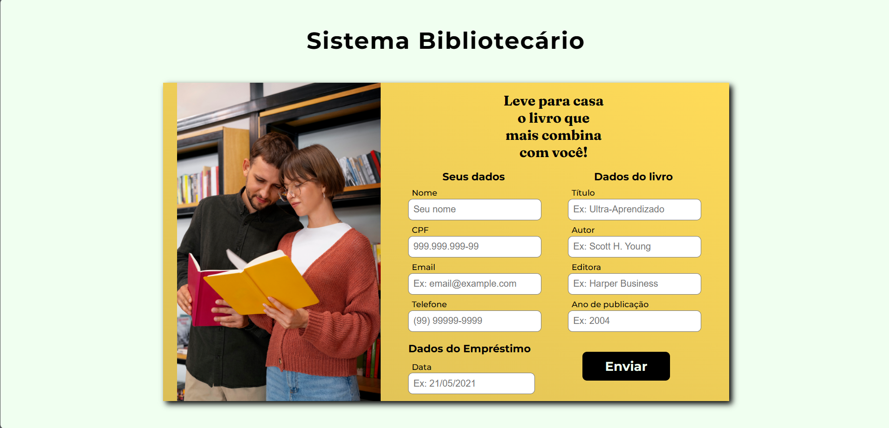

# Initialization

Project was started with [Create React App](https://github.com/facebook/create-react-app).

## Scripts

In the project directory, you can run:

### `npm start`

Runs the app in the development mode.\
Open [http://localhost:3000](http://localhost:3000) to view it in the browser.

The page will reload if you make edits.\
You will also see any lint errors in the console.

## Technologies
- React
- Typescript
- Styled-components
- Drona HQ

## Libraries
- Axios
- Styled-components
- Primereact (InputMask)

## About
It is a project to improve skills not just in Typescript, but also to improve my skills with React Hooks, mainly with types of the language, doing manipulation with <form> data.

Envisiousing performance and clean code.

In the project the user can, register books that is loaned to a person, that also have need fill all the `<input/>`, that will to an Mock API, reared in website [Drona HQ](https://apigenerator.dronahq.com/)

Also see the products list of the Mock API in route `/books`.

The user can filter the list of books, by someone's cpf, by a date specific of the loan and by year launcher book's.

# Preview
